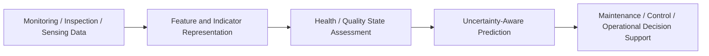

# Jia Liu

**Engineer & Researcher | Monitoring-to-Decision Modelling for Engineering Assets**

Health / Quality State Assessment · Predictive Maintenance · Process Monitoring · Decision Optimisation · Engineering AI

  
  
  
  
  
  

---

## Research Identity

I work on decision-oriented engineering AI for asset health and process quality
assessment. My research interest is how monitoring, inspection, and sensing
data can be transformed into interpretable health or quality states, and how
these states can support maintenance, control, and operational decisions under
uncertainty.

My current focus is on:

- health-state modelling and predictive maintenance for degradation-driven engineering assets;
- maintenance and replacement decision support under uncertainty;
- process monitoring and quality-state assessment for automated/additive manufacturing;
- transferable monitoring-to-decision workflows for energy assets, infrastructure systems, and manufacturing processes.

## Research Pipeline

This pipeline reflects a decision-oriented view of engineering AI: monitoring
data are not the endpoint, but the starting point for interpretable state
assessment and practical engineering decisions.

## Featured Research Demos

### 1. [Battery Predictive Maintenance Decision](https://github.com/liujiaresearcher-hash/battery-predictive-maintenance-decision)

A lightweight, public-safe Python demo for battery health-state assessment,
degradation-aware maintenance triggers, and decision support for energy asset
management.

Main role: energy asset PHM / BESS-oriented predictive maintenance demo.

### 2. [Infrastructure Maintenance Decision Support](https://github.com/liujiaresearcher-hash/infrastructure-maintenance-decision-support)

A reproducible demo for Semi-Markov deterioration modelling and finite-horizon
maintenance decision optimisation for engineering assets.

Main role: methodological foundation for deterioration-state modelling and
maintenance decision-making.

### 3. Physics-Informed GNN for Wind-Turbine Drivetrain Health Monitoring

A reproducible proof of concept combining a simulated torsional drivetrain
graph, gearbox health estimation, next-step response prediction, and nodal
torque-balance regularization.

- MLP, GNN and physics-informed GNN comparison
- ID and three extrapolation regimes
- Leakage-free trajectory splits and multi-seed evaluation
- Physics-consistency and predictive-performance assessment

[Repository](https://github.com/liujiaresearcher-hash/wind-turbine-physics-informed-gnn)

### 4. [AM Layer Consistency Monitoring](https://github.com/liujiaresearcher-hash/am-layer-consistency-monitoring)

A public-safe image-processing demo for layer-wise additive manufacturing
process monitoring and quality-state assessment.

Main role: process monitoring and quality-state evidence for automated /
additive manufacturing.

## Exploratory State-Feedback Extensions

I have also built small exploratory demos on wearable-state profiling and
movement-state feedback. These repositories are not the main focus of my
current PhD application direction, but they reflect a broader interest in
interpretable state assessment and feedback design.

- [wearable-human-state-profiling](https://github.com/liujiaresearcher-hash/wearable-human-state-profiling)
- [human-movement-state-feedback](https://github.com/liujiaresearcher-hash/human-movement-state-feedback)

## Technical Skills

  

| Area | Skills |
| --- | --- |
| **Programming & Data** | Python, MATLAB, data analysis, scientific computing |
| **Engineering Modelling** | degradation modelling, condition assessment, process monitoring, quality-state indicators |
| **AI / Decision Modelling** | predictive maintenance, PHM, stochastic processes, Semi-Markov decision processes, dynamic programming, decision optimisation |
| **Research & Documentation** | Git, GitHub, VS Code, Markdown, LaTeX, reproducible research documentation |

## Research Vision

My long-term goal is to develop reliable and interpretable
monitoring-to-decision frameworks for engineering systems, especially where
physical degradation, process variability, uncertainty, and decision constraints
must be considered together.

## Contact

  
  

