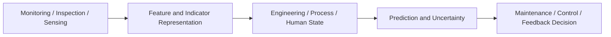

# Jia Liu

**Engineer & Researcher | Monitoring-to-Decision Modelling for Engineering, Manufacturing, and Human-Centred Systems**

Asset Health Monitoring · Predictive Maintenance · Physics-Informed Learning · Process State Estimation · Decision and Control Support

  
  
  
  
  

---

## Research Identity

I work on decision-oriented engineering AI for asset health management, manufacturing-process quality control, and human-centred automation.

My research interest is how monitoring, inspection, sensing, and simulation data can be transformed into interpretable engineering, process, or human states, and how these states can support prediction, maintenance, control, feedback, and operational decisions under uncertainty.

My current focus includes:

- health-state modelling and predictive maintenance for degradation-driven energy and mechanical assets;
- physics-informed and graph-based learning for interacting engineering components;
- stochastic deterioration modelling and maintenance decision optimisation;
- process-state monitoring and transparent closed-loop control for additive manufacturing;
- wearable operator-state sensing, uncertainty-aware interpretation, and feedback design as a human-centred extension; and
- transferable monitoring-to-decision workflows across energy assets, infrastructure systems, manufacturing processes, and human-centred systems.

## Monitoring-to-Decision Pipeline

Monitoring data are not treated as the endpoint. The objective is to construct interpretable state representations and connect them to defensible engineering or human-centred decisions.

## Featured Research Demos

### Asset Health and Maintenance Decisions

#### 1. [Battery Predictive Maintenance Decision](https://github.com/liujiaresearcher-hash/battery-predictive-maintenance-decision)

A reproducible battery PHM baseline linking health-related feature extraction, remaining-life estimation, uncertainty indicators, and degradation-aware maintenance-policy comparison.

**Research role:** energy asset PHM, predictive maintenance, and health-to-decision modelling.

---

#### 2. [Physics-Informed Health Monitoring and Health-Aware RL Control for a Wind-Turbine Drivetrain](https://github.com/liujiaresearcher-hash/wind-turbine-physics-informed-gnn)

A reproducible research prototype linking component-graph health estimation, physics-consistent dynamic prediction, and degradation-aware derating control in a simulated five-component wind-turbine drivetrain.

The project first compares MLP, GNN, and physics-informed GNN models for gearbox health-parameter estimation and next-step drivetrain-response prediction. It then extends the monitoring pipeline with greedy, rule-based, health-unaware PPO, and health-aware PPO control policies to examine the trade-off between cumulative normalized energy and gearbox-load-induced synthetic degradation under unseen wind profiles.

**Research role:** physics-informed PHM, health-aware reinforcement learning, and monitoring-to-decision integration.

---

#### 3. [Infrastructure Maintenance Decision Support](https://github.com/liujiaresearcher-hash/infrastructure-maintenance-decision-support)

A reproducible demo for Semi-Markov deterioration modelling and finite-horizon maintenance decision optimisation.

**Research role:** stochastic degradation modelling, engineering-asset condition assessment, and maintenance decision support.

### Additive Manufacturing Process Monitoring and Control

#### 4. [WAAM Arc-Length Monitoring and Closed-Loop Control](https://github.com/liujiaresearcher-hash/waam-arc-length-monitoring-control)

A synthetic and reproducible WAAM process demo covering residual-aware arc-length filtering, trend detection, rule-based duty-cycle recommendation, and open-loop versus closed-loop evaluation.

The repository demonstrates how noisy process observations can be converted into an interpretable process state and then into transparent control recommendations.

**Research role:** process-state estimation, monitoring-to-control integration, and closed-loop additive-manufacturing research.

---

#### 5. [AM Layer Consistency Monitoring](https://github.com/liujiaresearcher-hash/am-layer-consistency-monitoring)

A public-safe image-processing demo for layer-wise additive-manufacturing monitoring and quality-state assessment.

**Research role:** visual process monitoring, geometric consistency assessment, and manufacturing-quality evidence.

### Human-Centred State Sensing and Feedback

#### 6. [Wearable Human-State Profiling](https://github.com/liujiaresearcher-hash/wearable-human-state-profiling)

An operator-state sensing baseline using wearable physiological and motion signals, leave-one-subject-out evaluation, uncertainty-aware outputs, subject-level profiles, and feedback-card generation.

**Research role:** human-state sensing extension, interpretable operator-state assessment, and future HRC feedback inputs.

---

#### 7. [Human Movement-State Feedback](https://github.com/liujiaresearcher-hash/human-movement-state-feedback)

A companion movement-state prototype using synthetic 2D pose landmarks to explore movement-quality indicators, ergonomic-state cues, feedback rationale, and future user-study design.

**Research role:** movement and ergonomic-state feedback prototyping for human-centred systems.

## How the Projects Connect

| Research problem                                                 | Demonstration                                      |
| ---------------------------------------------------------------- | -------------------------------------------------- |
| Health assessment and maintenance decisions for energy assets    | Battery Predictive Maintenance Decision            |
| Physics-informed health estimation and degradation-aware operational control | [Wind-Turbine Drivetrain Monitoring and Health-Aware RL Control](https://github.com/liujiaresearcher-hash/wind-turbine-physics-informed-gnn) |
| Stochastic deterioration and sequential maintenance optimisation | Infrastructure Maintenance Decision Support        |
| Process-state estimation and feedback-control evaluation         | WAAM Arc-Length Monitoring and Closed-Loop Control |
| Visual consistency and manufacturing-quality monitoring          | AM Layer Consistency Monitoring                    |
| Operator-state sensing, uncertainty and interpretable feedback    | Wearable Human-State Profiling                     |
| Movement and ergonomic-state feedback prototyping                 | Human Movement-State Feedback                      |

Together, these repositories explore a common question:

> How can heterogeneous sensing and monitoring data be transformed into interpretable engineering, process, or human states and then connected to reliable decisions, control, or feedback?

## Technical Skills

| Area                      | Skills                                                                                                         |
| ------------------------- | -------------------------------------------------------------------------------------------------------------- |
| **Programming and Data**  | Python, MATLAB, pandas, NumPy, scientific computing                                                            |
| **Machine Learning**      | PyTorch, PyTorch Geometric, scikit-learn, graph neural networks                                                |
| **Engineering Modelling** | degradation modelling, condition assessment, simplified dynamic simulation, process monitoring                 |
| **Decision and Control**  | predictive maintenance, Semi-Markov decision processes, dynamic programming, rule-based closed-loop evaluation |
| **Research Practice**     | Git, GitHub, VS Code, Markdown, LaTeX, reproducible experiments and technical documentation                    |

## Research Vision

My long-term goal is to develop reliable and interpretable monitoring-to-decision methods for complex engineering systems, especially where physical degradation, process variability, uncertainty, and operational constraints must be considered together.

## Contact

  
  

