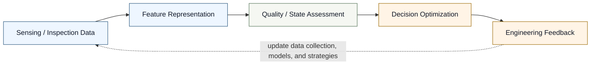
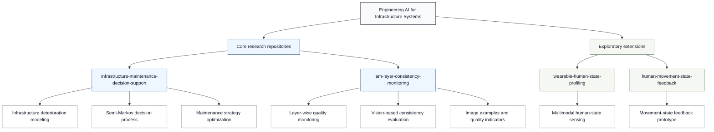

# Jia Liu

**Engineer & Researcher | Engineering AI for Infrastructure Systems**

Infrastructure Monitoring · Additive Manufacturing Quality Assessment · Mechanics-informed AI · Decision Optimization

---

## Research Overview

I work on **Engineering AI for Infrastructure Systems**, with a focus on
connecting sensing, inspection, and monitoring data to engineering decisions.
My research interests span civil infrastructure, bridge engineering,
additive manufacturing quality assessment, inspection and monitoring data,
mechanics-informed modeling, and maintenance decision optimization.

The central research question behind my work is how engineering systems can
move from raw observations to reliable, interpretable, and actionable decisions.
This includes representing field or image-based data, assessing quality or
structural state, modeling uncertainty, and supporting maintenance or process
feedback.

## Research Pipeline

This pipeline reflects a decision-oriented view of engineering AI:
data are not treated as the endpoint, but as the starting point for
state assessment, uncertainty-aware modeling, and practical engineering action.

## Research Ecosystem

## Core Research Directions

### Infrastructure Condition Intelligence

I am interested in methods that convert inspection and monitoring observations
into interpretable condition indicators for bridges and infrastructure systems.
This direction emphasizes deterioration representation, uncertainty awareness,
and maintenance-relevant state assessment.

### Additive Manufacturing Quality Systems

I explore vision-based and data-driven approaches for layer-wise quality
assessment in additive manufacturing. The goal is to evaluate process
consistency from image data and develop quality indicators that can support
process monitoring and engineering feedback.

### Mechanics-informed Decision Modeling

My work connects data-driven assessment with physical reasoning and decision
models. I am particularly interested in stochastic deterioration modeling,
semi-Markov decision processes, and optimization methods that translate state
information into maintenance or control strategies.

## Featured Projects

### [infrastructure-maintenance-decision-support](https://github.com/liujiaresearcher-hash/infrastructure-maintenance-decision-support)

**Problem:** Infrastructure assets deteriorate under uncertainty, and
maintenance decisions must account for condition evolution, risk, cost, and
long-term performance.

**Method:** The project frames deterioration and intervention planning through
a semi-Markov decision process for bridge and infrastructure maintenance.

**Output:** Decision-support logic for evaluating maintenance strategies under
uncertain deterioration trajectories.

**Research relevance:** This repository represents the decision optimization
core of my research narrative, linking infrastructure state modeling with
maintenance strategy selection.

### [am-layer-consistency-monitoring](https://github.com/liujiaresearcher-hash/am-layer-consistency-monitoring)

**Problem:** Additive manufacturing quality can vary across layers, and
layer-wise inconsistency may affect final part reliability.

**Method:** The project uses vision-based layer consistency evaluation with
synthetic or custom image examples and interpretable quality indicators.

**Output:** A monitoring workflow for extracting layer-level visual features
and assessing quality consistency.

**Research relevance:** This repository extends engineering AI from civil
infrastructure into manufacturing quality assessment, while preserving the same
data-to-assessment-to-feedback logic.

### [wearable-human-state-profiling](https://github.com/liujiaresearcher-hash/wearable-human-state-profiling)

**Problem:** Human state can influence operational performance, safety, and
interaction with engineered systems.

**Method:** The project explores multimodal sensing for human state estimation
and operational state profiling.

**Output:** An exploratory workflow for organizing sensing signals into
human-state indicators.

**Research relevance:** This is an exploratory extension of my broader interest
in sensing-based state assessment, with potential relevance to human factors in
engineering operations.

### [human-movement-state-feedback](https://github.com/liujiaresearcher-hash/human-movement-state-feedback)

**Problem:** Movement state estimation requires feedback structures that can
connect observed motion patterns to interpretable state updates.

**Method:** The project prototypes movement state estimation and feedback loop
modeling.

**Output:** A concise prototype for studying how movement-state information can
be represented and connected to feedback.

**Research relevance:** This repository is a compact exploratory prototype
related to state estimation and feedback modeling beyond infrastructure assets.

## Technical Skills

### Programming & Data

- Python
- MATLAB
- Data analysis
- Scientific computing

### Engineering

- Structural engineering
- Finite element analysis
- Bridge systems
- Civil infrastructure assessment

### AI / Modeling

- Computer vision for inspection
- Statistical modeling
- Stochastic processes
- Semi-Markov decision processes
- Maintenance decision optimization

## Research Vision

My long-term research vision is to develop reliable, interpretable, and
decision-oriented engineering AI systems by integrating monitoring data,
physical knowledge, and optimization models.

Rather than treating AI as a standalone prediction tool, I aim to study how
models can support engineering reasoning: what should be measured, how system
state should be represented, how uncertainty should be handled, and how
assessment results can inform maintenance, manufacturing, or operational
decisions.

## Contact

- Email: [liujia.researcher@gmail.com](mailto:liujia.researcher@gmail.com)
- GitHub: [https://github.com/liujiaresearcher-hash](https://github.com/liujiaresearcher-hash)
