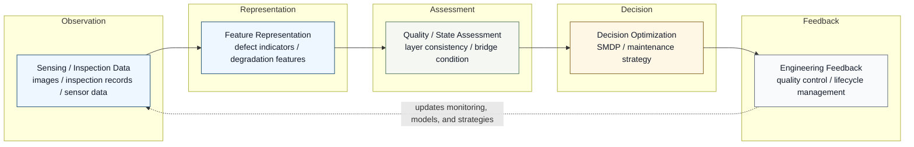
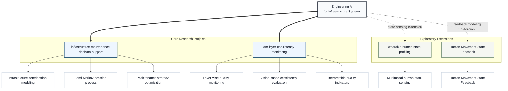

# Jia Liu

**Engineer & Researcher | Engineering AI for Infrastructure Systems**

Infrastructure Monitoring &middot; Additive Manufacturing Quality Assessment &middot; Mechanics-informed AI &middot; Decision Optimization

  
  
  
  
  
  

---

## Research Identity

I work on **engineering AI for infrastructure systems**, with a focus on
connecting monitoring, inspection, and sensing data to reliable engineering
decisions. My interests sit at the intersection of civil infrastructure,
bridge engineering, additive manufacturing quality assessment,
mechanics-informed modeling, and maintenance decision optimization.

The central question behind my work is how engineered systems can move from
raw observations to interpretable state assessment and practical action. I am
especially interested in workflows that combine data-driven representation,
physical reasoning, uncertainty awareness, and decision models.

## Research Pipeline

This pipeline reflects a decision-oriented view of engineering AI: data are
not the endpoint, but the starting point for condition representation,
uncertainty-aware assessment, and engineering action.

## Research Ecosystem

## Core Research Directions

### Infrastructure Condition Intelligence

I study methods that convert inspection and monitoring observations into
interpretable condition indicators for bridges and infrastructure systems.
This direction emphasizes deterioration representation, uncertainty awareness,
and maintenance-relevant state assessment.

### Additive Manufacturing Quality Systems

I explore vision-based and data-driven approaches for layer-wise quality
assessment in additive manufacturing. The goal is to evaluate process
consistency from image data and develop quality indicators that support
process monitoring and engineering feedback.

### Mechanics-informed Decision Modeling

My work connects data-driven assessment with engineering mechanics and
decision models. I am particularly interested in stochastic deterioration
modeling, semi-Markov decision processes, and optimization methods that
translate state information into maintenance or control strategies.

## Featured Projects

### [infrastructure-maintenance-decision-support](https://github.com/liujiaresearcher-hash/infrastructure-maintenance-decision-support)

Decision-support modeling for infrastructure maintenance under uncertain
deterioration.

| Field | Summary |
| --- | --- |
| **Problem** | Infrastructure assets deteriorate under uncertainty, while maintenance decisions must balance condition, risk, cost, and long-term performance. |
| **Method** | Semi-Markov decision process modeling for bridge and infrastructure maintenance planning. |
| **Output** | Decision-support logic for evaluating maintenance strategies under uncertain deterioration trajectories. |
| **Research relevance** | Forms the decision-optimization core of my research narrative by linking infrastructure state modeling with maintenance strategy selection. |

### [am-layer-consistency-monitoring](https://github.com/liujiaresearcher-hash/am-layer-consistency-monitoring)

Vision-based monitoring workflow for layer-wise quality consistency in
additive manufacturing.

| Field | Summary |
| --- | --- |
| **Problem** | Layer-wise quality variation in additive manufacturing may affect final part reliability and process stability. |
| **Method** | Image-based consistency evaluation using interpretable layer-level quality indicators. |
| **Output** | A monitoring workflow for extracting visual features and assessing layer consistency. |
| **Research relevance** | Extends engineering AI from civil infrastructure to manufacturing quality assessment while preserving a data-to-assessment-to-feedback logic. |

### [wearable-human-state-profiling](https://github.com/liujiaresearcher-hash/wearable-human-state-profiling)

Exploratory sensing workflow for organizing human-state information in
engineering contexts.

| Field | Summary |
| --- | --- |
| **Problem** | Human state can influence operational performance, safety, and interaction with engineered systems. |
| **Method** | Multimodal sensing organization for human-state estimation and operational state profiling. |
| **Output** | A structured exploratory workflow for converting sensing signals into human-state indicators. |
| **Research relevance** | Broadens the state-assessment theme toward human factors by exploring how wearable sensing signals can be organized into interpretable human-state indicators. |

### [Human Movement-State Feedback](https://github.com/liujiaresearcher-hash/human-movement-state-feedback)

Pose-landmark pipeline for movement-quality indicators, ergonomic state cues,
feedback rationale, and future user-study design.

| Field | Summary |
| --- | --- |
| **Problem** | How can body-tracking data be transformed into interpretable movement-state indicators and user-facing feedback? |
| **Method** | Synthetic 2D pose landmarks; joint/segment kinematics; movement-quality indicators; ergonomic state cues; feedback rationale cards. |
| **Output** | Movement-state summaries, ergonomic cue summaries, feedback design cards, and a future user-study plan. |
| **Research relevance** | Connects pose-based movement-state indicators with embodied interaction, ergonomic-state cues, interpretable feedback mapping, and human-centred work systems. |

Boundary: synthetic 2D pose landmarks only; not a clinical rehabilitation tool, full RULA/REBA assessment, or full biomechanical model.

## Technical Skills

  

| Area | Skills |
| --- | --- |
| **Programming & Data** | Python, MATLAB, data analysis, scientific computing |
| **Engineering Modeling** | Structural engineering, bridge systems, finite element analysis, civil infrastructure assessment |
| **AI / Decision Modeling** | Computer vision for inspection, statistical modeling, stochastic processes, semi-Markov decision processes, maintenance decision optimization |
| **Research & Documentation** | Git, GitHub, VS Code, Markdown, LaTeX, reproducible research documentation |

## Research Vision

My research vision is to develop reliable, interpretable, and
decision-oriented engineering AI systems by integrating monitoring data,
physical knowledge, and optimization models.

Rather than treating AI as a standalone prediction tool, I aim to study how
models can support engineering reasoning: what should be measured, how system
state should be represented, how uncertainty should be handled, and how
assessment results can inform maintenance, manufacturing, or operational
decisions.

## Contact

  
  

